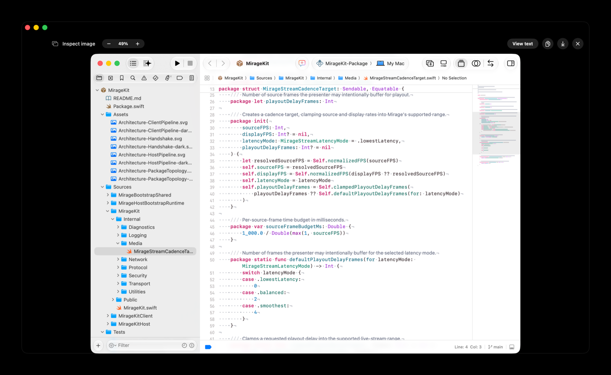
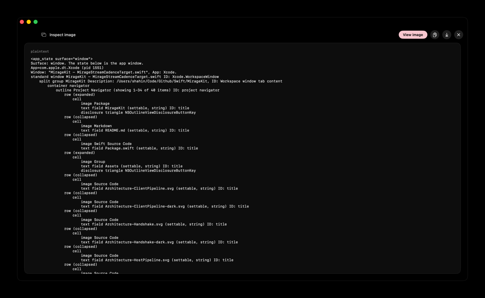
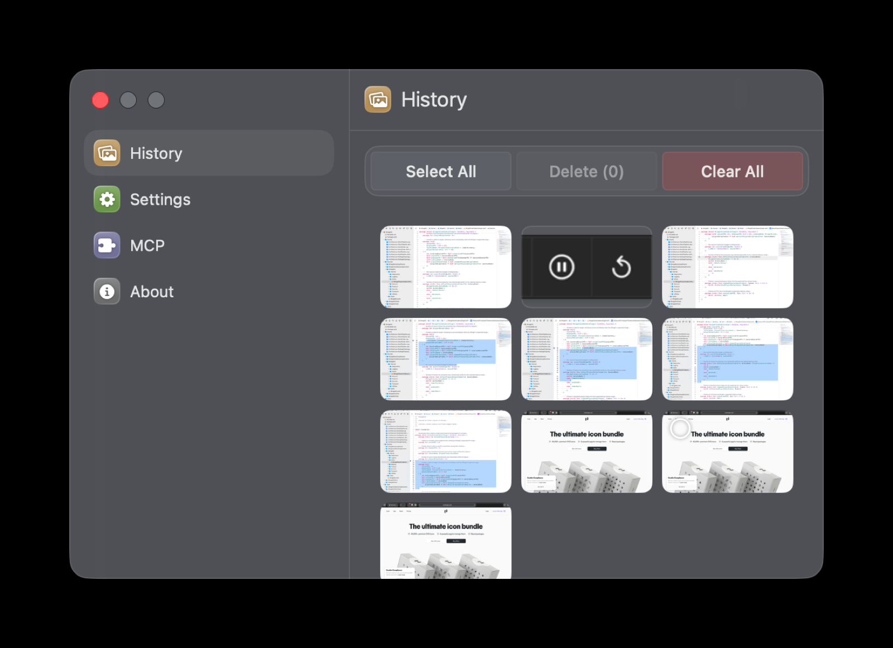

# Appshots


Appshots is a small macOS 15+ menu bar app for sending app context to coding agents. It captures the frontmost app window screenshot plus app state text generated by its built-in macOS accessibility and ScreenCaptureKit engine, then copies a Codex-style appshot prompt and the screenshot to your clipboard.

Inspired by [OpenAI Codex appshots](https://developers.openai.com/codex/appshots), this exists so Claude Code and other agents can get the same kind of visual + accessibility context on macOS.

Press left Option + right Option to capture the frontmost app, or use the menu bar popover.

<p align="center">
  <a href="docs/media/appshots-demo.mp4"></a>
</p>

<p align="center"><sub><a href="docs/media/appshots-demo.mp4">▶ Watch the full-quality demo</a></sub></p>

The capture/control surface is also available headlessly from the `appshotsctl` CLI — capture, readback/search/delete, configuration, the trigger key, launch-at-login, MCP registration, shell completion, benchmarking, and a daemon that hosts the global hot key without any GUI. GUI-only surfaces such as the popover, preview/history UI, and interactive Sparkle update flow stay in `Appshots.app`. See [Headless CLI usage](docs/headless-cli.md).

## Screenshots

Every capture keeps both a screenshot and the app's accessibility tree. The preview window shows either view, and what an agent consumes is the Codex-style `<appshot>` prompt rendered from them.

<p align="center">
  
  
</p>

Every capture is persisted, so you can browse, re-copy, or clear past captures from the History pane.

<p align="center">
  
</p>

## Install

Download the latest signed, notarized **[Appshots.dmg](https://github.com/Shahfarzane/appshots/releases/latest/download/Appshots.dmg)** (macOS 15+, Apple silicon), open it, and drag Appshots to Applications. CLI-only users can grab the standalone `appshotsctl-<version>-arm64.zip` from the [latest release](https://github.com/Shahfarzane/appshots/releases/latest).

Or build from source:

```sh
swift build
scripts/build-app.sh debug   # assembles .build/Appshots.app with the helper embedded
```

Releases come from `.github/workflows/macos-release-production.yml` and `Distribution/Scripts/release.sh`: a signed, notarized, stapled `Appshots.dmg` plus a signed/notarized standalone `appshotsctl-<version>-arm64.zip` for GUI-less / headless / agent setups. The app bundles the same helper at `Appshots.app/Contents/Helpers/appshotsctl` and auto-updates via Sparkle once an appcast is published.

The standalone CLI ships with its own stable TCC identity (`CFBundleIdentifier = ceo.nerd.appshots.cli`), so its Accessibility / Screen Recording grants persist across upgrades. The Homebrew formula lives at `Distribution/Homebrew/appshotsctl.rb`; it is only installable after the release zip URL and sha256 point at a published artifact. See [Headless CLI usage](docs/headless-cli.md) for granting per-binary permissions.

> The standalone CLI and the app are **separate** macOS TCC subjects. Each binary that captures (the app, the standalone CLI, the LaunchAgent daemon) needs its own Accessibility + Screen Recording grant in **System Settings > Privacy & Security**.

## Claude Code plugin

The fastest setup for Claude Code: install the Appshots plugin. It registers the native MCP server for you and ships skills (`capture`, `latest`, `list`, `search`, `doctor`).

```text
/plugin marketplace add Shahfarzane/appshots
/plugin install appshots
```

The plugin's MCP server runs `bin/appshotsctl mcp`, where `bin/appshotsctl` is a small resolver that finds your installed `appshotsctl` (Homebrew, the app bundle, `PATH`, or a local `.build/`). See [MCP_SETUP.md](MCP_SETUP.md) for manual registration and `appshotsctl mcp install/uninstall/status`.

## Agent fast path

Every capture is stored under `~/.appshots/snapshots/<date>/<capture-id>/` and updates these stable pointers:

- `~/.appshots/latest.md` — Codex-style `<appshot ...>` prompt text.
- `~/.appshots/latest.txt` — absolute path to the latest capture directory.
- `~/.appshots/latest.json` — machine-readable metadata for the latest capture.
- `~/.appshots/index.json` — capture history.

Each capture directory contains:

- `screenshot.png`
- `transition-snapshot.png` — polished preview (rounded screenshot, bottom fade, centered app icon + title) used for the capture animation; the full `screenshot.png` still feeds the model and clipboard
- `accessibility_tree.txt`
- `accessibility_tree.json`
- `page_url.txt` when a browser URL is visible
- `appshot.md`
- `context.json`
- `debug.md` — fuller debug prompt with local file references
- `capture_diagnostics.json` when screenshot diagnostics are available
- `capture_metrics.json` when capture timings were recorded
- `metadata.json`

For CLI agents, paste the copied text or run:

```sh
cat ~/.appshots/latest.md
```

For vision-capable agents, attach `screenshot.png` from the directory printed by:

```sh
cat ~/.appshots/latest.txt
```

## CLI

`appshotsctl` is the CLI and native MCP server. Use a released standalone binary, the app-bundled helper (`/Applications/Appshots.app/Contents/Helpers/appshotsctl`), or a local build:

```sh
swift build
.build/debug/appshotsctl help
```

### Capture from a terminal / agent

```sh
appshotsctl capture                    # capture the frontmost app, print appshot.md
appshotsctl capture --copy             # also copy the prompt + screenshot to the clipboard
appshotsctl capture --app Safari       # capture a specific running app by name or bundle id
appshotsctl capture --app com.apple.Safari --copy
```

`--copy` works headlessly (the CLI initializes the Cocoa pasteboard on demand), and is implied when `copyOnCapture` is enabled in settings. `--app` resolves a running app by bundle identifier or name; the frontmost app is used otherwise.

### Read captures

```sh
appshotsctl latest                     # print the latest appshot.md
appshotsctl latest --json              # metadata JSON
appshotsctl latest --image             # screenshot path
appshotsctl latest --model-prompt      # minimal model-facing prompt
appshotsctl latest --payload           # JSON: model prompt + image path + data URL + metadata
appshotsctl latest --context           # first-class AppshotContext JSON
appshotsctl latest --events            # completed capture event JSON
appshotsctl latest --dir               # capture directory
appshotsctl latest --metadata          # metadata.json path
appshotsctl list --limit 20            # recent captures as JSON
appshotsctl search "github"            # search indexed captures
appshotsctl delete <capture-id>        # delete a capture
appshotsctl doctor                     # check storage + permission health
```

Capture-event and timing variants: `capture --events`, `capture --event-stream` (newline-delimited JSON, `--timeout-seconds N`, default 120), `capture --events --timings`, `capture --timings`, and `benchmark [--app …] [--count N] [--warmup N]`. Event-streaming capture is frontmost-only; `--app` is rejected with `--events` / `--event-stream`.

### Configuration & control

All of these read/write the shared `~/.appshots/config.json`. Writes post a Darwin notification so a running GUI app or `daemon` live-reloads without a restart.

```sh
appshotsctl config list                # all keys + current values (--json for JSON)
appshotsctl config get triggerKey
appshotsctl config set copyOnCapture true
appshotsctl config unset triggerKey    # reset one key to its default
appshotsctl config path                # print the config.json path

appshotsctl trigger get                # show trigger key codes + readable labels
appshotsctl trigger set --preset option   # presets: option | command | shift
appshotsctl trigger set --keys 58,61      # raw CGKeyCode CSV
appshotsctl trigger reset                 # back to left+right Option (58,61)

appshotsctl sound enable|disable|status   # capture "shutter" sound
appshotsctl update auto on|off|status     # Sparkle auto-update toggle
appshotsctl onboarding status             # Accessibility + Screen Recording + onboarding state
```

Config keys: `triggerKey`, `captureSound`, `copyOnCapture`, `onboardingCompleted`, `startupMode`, `autoUpdate`, `showInDock`, `mcpDefaultScope`, `mcpLastProjectDirectory`, `postCaptureSendTarget`.

`postCaptureSendTarget` is the Codex-style composer handoff: set it to an app's bundle id (e.g. `com.anthropic.claudefordesktop` for Claude Desktop) and every capture from the menu-bar app or the daemon (not the one-shot CLI) activates the app and pastes the screenshot plus a one-line reference (`Attached appshot <id>. Full context: …/appshot.md`) into its input box — not the full AX-tree markup, which an agent fetches via the MCP tools or the file path when it needs it. The clipboard is left holding the standard full-markup copy afterwards. Also configurable in the GUI under Settings → General → "Send capture to". Empty disables it.

Exit codes are `0` (ok), `1` (failure), and `2` (usage error / not found).

### Daemon (headless hot key)

`NSEvent` global monitors need a running AppKit loop, so the menu-bar app is the primary hot-key host. For GUI-less setups, run the daemon — a dock-less (`NSApplication.accessory`) host for the same global trigger:

```sh
appshotsctl daemon
```

It owns the hot key only in `headless` startup mode — the menu-bar app owns it otherwise, and the daemon exits cleanly if launched in another mode — and an advisory lock (`~/.appshots/hotkey.lock`) keeps a single daemon, so the chord never double-fires. It live-reloads the trigger key and `copyOnCapture` on config changes, and yields if the startup mode changes. You normally don't run it by hand — `startup enable` installs it as a LaunchAgent (below).

### Launch at login

```sh
appshotsctl startup status                 # startup mode + daemon LaunchAgent state
appshotsctl startup enable                 # default: install the headless daemon LaunchAgent
appshotsctl startup enable --headless      # explicit headless
appshotsctl startup enable --gui           # record GUI login-item intent (applied by the app)
appshotsctl startup disable                # stop launching at login
```

The GUI app has its own **Launch at Login** toggle (General settings) backed by `SMAppService`. The headless and GUI paths are mutually exclusive. See [Launch at login](docs/launch-at-login.md).

### Help & shell completion

```sh
appshotsctl help                 # top-level usage
appshotsctl help startup         # focused help for one command
appshotsctl startup --help       # …same, via the flag
appshotsctl --version            # version
appshotsctl completion zsh       # print a zsh completion script
appshotsctl completion bash      # print a bash completion script
```

Install zsh completion with `appshotsctl completion zsh > "${fpath[1]}/_appshotsctl"` then `compinit`. State-changing commands (`startup`, `mcp`) accept `-n/--dry-run` to preview without applying.

## MCP

Appshots ships a native MCP stdio server built into `appshotsctl` (no Python). The easiest setup is the [Claude Code plugin](#claude-code-plugin), which registers it for you. To register manually with Claude Code:

```sh
# Via the CLI's own command (registers the running appshotsctl as the server):
appshotsctl mcp install --scope user
appshotsctl mcp install --scope project --project .
appshotsctl mcp status
appshotsctl mcp status --json
appshotsctl mcp uninstall --scope user

# Or directly with the claude CLI:
claude mcp add appshots -s user -- "/Applications/Appshots.app/Contents/Helpers/appshotsctl" mcp
```

Use `-n` / `--dry-run` with `mcp install` or `mcp uninstall` to print the Claude CLI command without applying it. You can also enable MCP from the app: Settings → **MCP** tab → Install. See [MCP_SETUP.md](MCP_SETUP.md) for project scope and development paths.

Tools:

- `take_appshot`
- `get_latest_appshot`
- `get_appshot_image`
- `list_appshots`
- `search_appshots`
- `delete_appshot`
- `doctor_appshots`

Prompts (user-invocable — they surface as slash commands / attach-menu entries in MCP clients and land the appshot *in your message*, no tool call needed):

- `latest-appshot` — attach the most recent capture (press the hot key, then invoke this)
- `appshot` — capture now and attach; pass `app` (name or bundle id) to target a specific running app

`take_appshot` and `get_latest_appshot` default to `format: "codex"`, the model-facing shape Codex expects: one text item with the `<appshot>` block plus one image item with the screenshot. Other supported MCP formats are `prompt`, `model_prompt`, `json`, `payload`, `context`, `events`, `image_path`, and `directory`. Use `format: "context"` for the first-class `AppshotContext` object, including app icon and transition snapshot data when available, or `format: "events"` for the capture status log. For local streaming integrations, `capture --event-stream` writes newline-delimited event JSON as capture phases are emitted.

See [`MCP_SETUP.md`](MCP_SETUP.md) for Claude Desktop, Cursor, and CLI-agent examples.

## Development

SwiftPM package (Swift 6, strict concurrency, macOS 15+). `Appshots.xcodeproj` is generated — regenerate it with [`xcodegen`](https://github.com/yonaskolb/XcodeGen) after changing `project.yml`; never edit it by hand.

```sh
swift build                       # build everything (debug)
swift test                        # run the test suite (Swift Testing)
scripts/build-app.sh [release]    # assemble a runnable Appshots.app under .build/
.build/debug/appshotsctl latest   # run the CLI
```

CI is intentionally local-first: run `swift build` + `swift test` on your machine, then record the green run on the pushed commit with [`gh signoff`](https://github.com/basecamp/gh-signoff) (the required check on `main`). GitHub Actions is reserved for releases: pushing a `v*` tag runs the sign / notarize / DMG / Sparkle pipeline in `.github/workflows/macos-release-production.yml`, driven by `Distribution/Scripts/release.sh`.

See [AGENTS.md](AGENTS.md) for architecture notes and the conventions AI coding agents follow in this repo.

## License

[MIT](LICENSE)
